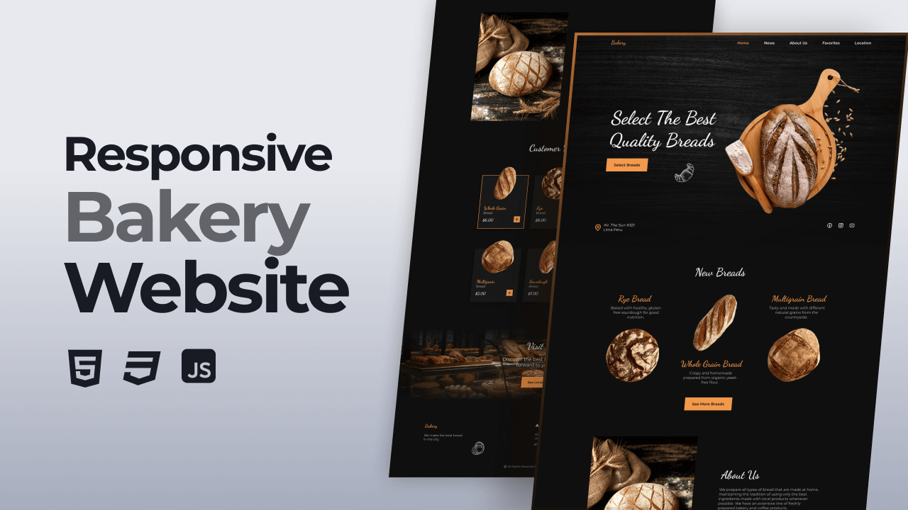

# PanArteWeb

¡Bienvenido a PanArteWeb, la panadería virtual donde la magia del pan cobra vida!

## Descripción

PanArteWeb es una página web responsiva dedicada a la venta de productos de panadería de alta calidad.

## Créditos

Este proyecto fue creado siguiendo el tutorial de [Bedimcode](https://youtu.be/TTOkgUNmNk0?si=pl48-BWBPUu_r-nZ) en YouTube. Agradezco a Bedimcode por proporcionar un recurso tan útil y educativo para la creación de esta página web.

## Características

- Catálogo de productos con imágenes y descripciones detalladas.
- Diseño responsivo para una experiencia óptima en todos los dispositivos.

## Capturas de Pantalla

